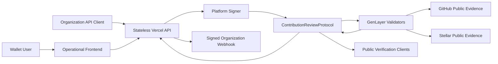
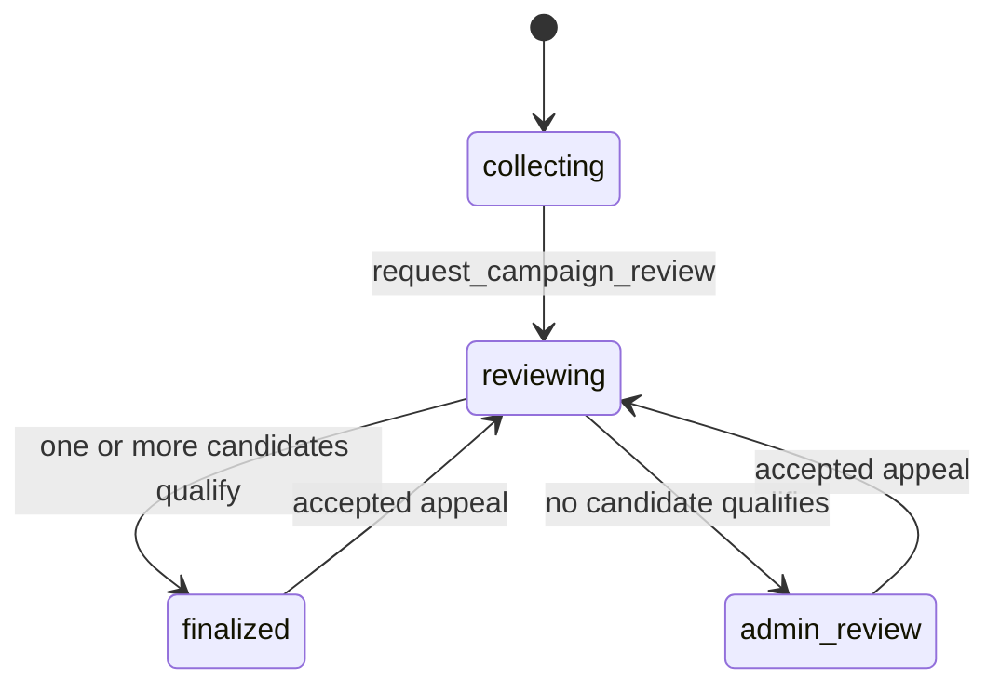
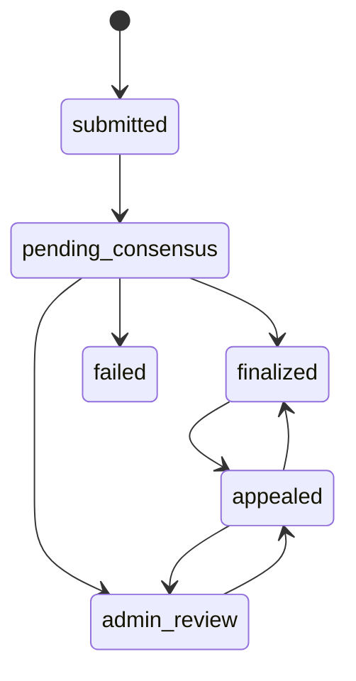
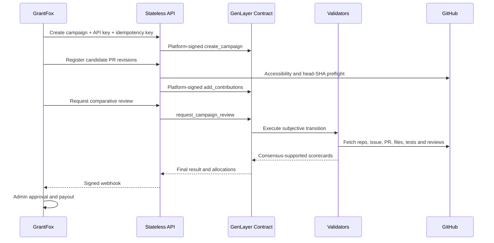

# Open Source Bug Bounty Judge

Open Source Bug Bounty Judge is a GenLayer contribution-review protocol for
open-source campaigns. It independently fetches GitHub repository evidence,
scores candidate contributions, ranks qualifying work, and recommends how a
fixed USDC campaign budget should be allocated.

The MVP never pays contributors. Organizations such as GrantFox retain final
approval and payout control.

> Status: the application, stateless API, Intelligent Contract, direct tests,
> and StudioNet integration-test harness are implemented. The current StudioNet
> deployment is recorded in `deployment.studionet.json`.

Production application: https://open-source-bug-bounty-judge.vercel.app

Current StudioNet deployment:

```text
Contract: 0x1456602BD82695d5EAc97dCC41ecb761f66f2ca7
Transaction: 0x8c9c4b5fef3a1696adc94115b9782bebb8af380e6bd037569eced66b77012c72
Platform wallet: 0xEd9EDd8586b20524CafA4F568413C504C9B03172
Execution: SUCCESS
Consensus: MAJORITY_AGREE, 5/5 validators
```

## Contents

- [What This DApp Does](#what-this-dapp-does)
- [Protocol Properties](#protocol-properties)
- [Trust Boundary](#trust-boundary)
- [Quick Start](#quick-start)
- [Review Flow](#review-flow)
- [System Architecture](#system-architecture)
- [Decentralization Model](#decentralization-model)
- [Evidence Acquisition](#evidence-acquisition)
- [Scoring And Allocation](#scoring-profiles)
- [Authentication And Authorization](#authentication-and-authorization)
- [API Integration Guide](#api-integration-guide)
- [Wallet User Guide](#wallet-user-guide)
- [Contract Interface](#contract-interface)
- [State Machines](#state-machines)
- [Webhooks](#webhooks)
- [Security And Threat Model](#threat-model)
- [Local Development](#local-development)
- [Testing](#testing)
- [StudioNet Deployment](#studionet-deployment)
- [Vercel Deployment](#vercel-deployment)
- [Operations Runbook](#operations-runbook)
- [Repository Structure](#repository-structure)
- [Current Limits](#current-limits)
- [Governance And Upgrades](#governance-and-upgrades)

## What This DApp Does

The protocol answers two related questions:

1. Does a contribution actually satisfy the issue and campaign requirements?
2. If multiple contributions qualify, what share of a fixed campaign budget
   should each contribution be recommended to receive?

An organization creates a campaign, defines its quality rubric and budget, and
registers immutable GitHub pull-request revisions. GenLayer validators then
fetch the repository evidence themselves and perform a comparative review.
The final scorecards, citations, ranking, shortlist, and recommended allocation
are stored on-chain.

The protocol supports two audiences:

- **Organizations and OSS platforms** integrate through scoped API keys. The
  API is a stateless relayer; the platform wallet signs all GenLayer writes.
- **Individual users** connect an EVM-compatible wallet, sign a review request,
  and receive an evidence-backed assessment of one public pull request.

This project is a **review and recommendation protocol**, not an escrow or
payment processor. A recommended USDC allocation is denominated in
micro-USDC for exact arithmetic, but no token transfer occurs.

## Protocol Properties

| Property | Implementation |
|---|---|
| Canonical storage | GenLayer Intelligent Contract |
| Application database | None |
| Evidence retrieval | Performed inside validator execution |
| Primary evidence | Public GitHub repository, issue, PR, files, source, commits, reviews, manifests and CI |
| Optional ecosystem evidence | HTTPS Stellar/Soroban evidence URLs |
| Subjective decision | Comparative GenLayer validator judgment |
| Allocation arithmetic | Deterministic score-squared integer allocation |
| Transaction signer | Server-side platform wallet |
| Organization authentication | Scoped API key whose SHA-256 hash is stored on-chain |
| Individual authentication | Short-lived wallet signature |
| Duplicate protection | Deterministic review key plus on-chain idempotency |
| Result delivery | Polling and signed webhooks |
| Payout authority | External organization administrator |
| Target network | GenLayer StudioNet |

The source of truth is the deployed contract. The hosted API and frontend are
replaceable clients around that contract.

## Trust Boundary

- GenLayer stores organizations, API-key hashes and scopes, campaigns,
  contributions, review keys, idempotency records, quotas, results, allocations,
  appeals, webhook endpoints, and webhook delivery marks.
- The Vercel API is stateless. It authenticates requests, runs GitHub
  accessibility preflight, signs transactions with the platform wallet, and
  reads finalized state.
- Validators fetch the repository, issue, pull request, changed files, raw
  source, tests, reviews, commits, project manifests, CI configuration, and
  optional Stellar evidence.
- PR descriptions and submitted test claims are context, never proof.

## Quick Start

Prerequisites:

- Node.js `24.x`.
- npm.
- GenLayer CLI for contract deployment and direct inspection.
- `uvx` for GenVM lint and direct contract tests.
- An EVM-compatible browser wallet for the individual-review UI.
- A GenLayer StudioNet account with funds for deployment and relayed writes.

Install and start the application:

```bash
npm install
cp .env.example .env.local
npm run dev
```

Open `http://localhost:3000`.

Without a deployed contract address, the interface can render but transaction
submission and contract reads return `CONTRACT_NOT_CONFIGURED`. The complete
local setup requires a deployed contract and the server-only platform signer.

Run the complete local verification suite:

```bash
npm run lint
npm run typecheck
npm test
npm run build
npm run contract:lint
npm run contract:test
```

## Review Flow

```text
Organization API key
  -> create on-chain campaign
  -> register canonical PR revisions
  -> request campaign review
  -> platform wallet signs StudioNet transaction
  -> validators independently fetch repository evidence
  -> comparative quality scoring
  -> deterministic score-squared allocation
  -> on-chain result
  -> signed webhook and admin review
```

Individual users connect a wallet and sign a short-lived review request. The
platform wallet still signs and submits the GenLayer transaction.

## Duplicate Protection

Campaign review keys commit to:

```text
organization | campaign | repository | PR number | head SHA | rubric | review kind
```

The API checks existing on-chain review keys before submission. The contract
also rejects duplicate review IDs, duplicate review keys, duplicate candidate
IDs, duplicate PRs in one campaign, conflicting idempotency keys, and repeated
appeal keys. Once a transaction hash exists, clients poll it instead of
resubmitting.

## Allocation

- Default quality threshold: `70/100`.
- Only eligible candidates meeting the threshold receive recommendations.
- Candidate weight is `score * score`.
- Integer micro-USDC allocations sum exactly to the submitted budget.
- If no candidate qualifies, allocation remains zero and the three strongest
  candidates are sent to the admin-review shortlist.

## API

All organization mutations use `Authorization: Bearer osj_live_...`.
Mutations also require `Idempotency-Key`.

```text
POST /api/v1/admin/api-keys
POST /api/v1/campaigns
GET  /api/v1/campaigns/:id
POST /api/v1/campaigns/:id/contributions
POST /api/v1/campaigns/:id/reviews
GET  /api/v1/reviews/:id
POST /api/v1/reviews/:id/appeals
POST /api/v1/reviews/single
POST /api/v1/webhook-endpoints
GET  /api/v1/health
GET  /api/v1/openapi
```

### API scopes

| Scope | Routes |
|---|---|
| `campaigns:write` | Create campaigns and add contributions |
| `reviews:create` | Start comparative campaign reviews |
| `reviews:read` | Read organization campaign records |
| `appeals:create` | Submit a new appeal revision |
| `webhooks:manage` | Set or replace an organization webhook endpoint |

API authorization is enforced twice: the API reads the on-chain key record
before relaying, and the contract consumes the same key hash and checks the
scope, organization, active flag, usage counter, and quota.

Errors use a stable envelope:

```json
{
  "error": {
    "code": "REVIEW_ALREADY_EXISTS",
    "message": "This pull request revision already has a review.",
    "request_id": "req_...",
    "retryable": false,
    "details": {}
  }
}
```

## API Integration Guide

The API uses asynchronous transaction submission. A `202 Accepted` response
means the transaction was submitted, not that validator consensus or contract
execution succeeded. Integrators must retain both the resource ID and
`transactionHash`, poll until the contract record exists, and inspect failures
before retrying.

Examples below assume:

```bash
export OSJ_BASE_URL="http://localhost:3000"
export OSJ_API_KEY="osj_live_replace_me"
export OSJ_ORGANIZATION_ID="grantfox"
```

### 1. Bootstrap an organization

This administrative route is used once for each organization. It is protected
by `PLATFORM_ADMIN_SECRET`, creates the organization on-chain, and returns the
plaintext API key exactly once.

```bash
curl -sS "$OSJ_BASE_URL/api/v1/admin/api-keys" \
  -X POST \
  -H "content-type: application/json" \
  -H "x-admin-secret: $PLATFORM_ADMIN_SECRET" \
  -d '{
    "organizationId": "grantfox",
    "organizationName": "GrantFox",
    "ownerWallet": "0x1111111111111111111111111111111111111111",
    "scopes": [
      "campaigns:write",
      "reviews:create",
      "reviews:read",
      "appeals:create",
      "webhooks:manage"
    ]
  }'
```

Successful submission:

```json
{
  "organizationId": "grantfox",
  "apiKey": "osj_live_<shown-once>",
  "scopes": [
    "campaigns:write",
    "reviews:create",
    "reviews:read",
    "appeals:create",
    "webhooks:manage"
  ],
  "transactionHash": "0x...",
  "warning": "This API key is shown once. Store it securely."
}
```

Do not use the new key until the organization-registration transaction has
executed successfully.

### 2. Create a campaign

Budgets use integer micro-USDC. `1000000000` represents `1,000 USDC`.
Rubric weights must total exactly 100.

```bash
curl -sS "$OSJ_BASE_URL/api/v1/campaigns" \
  -X POST \
  -H "authorization: Bearer $OSJ_API_KEY" \
  -H "idempotency-key: campaign-stellar-builders-2026" \
  -H "content-type: application/json" \
  -d '{
    "id": "stellar-builders-2026",
    "organizationId": "grantfox",
    "externalId": "grantfox-campaign-42",
    "name": "Stellar Builders Campaign",
    "budgetUsdcMicros": "1000000000",
    "qualityThreshold": 70,
    "startsAt": "2027-07-01T00:00:00.000Z",
    "endsAt": "2027-07-20T00:00:00.000Z",
    "evidenceCutoff": "2027-07-21T00:00:00.000Z",
    "rubricVersion": "code-v1",
    "rubric": {
      "correctness": 25,
      "tests": 20,
      "maintainability": 15,
      "scope_alignment": 15,
      "impact": 15,
      "complexity": 10
    }
  }'
```

The current contract stores campaign timestamps as normalized strings. The
integration should still submit real ISO 8601 timestamps and enforce its own
campaign-closing policy before requesting a review.

### 3. Register immutable contribution revisions

The same GitHub pull request cannot be registered twice in one campaign.
Changing the PR after registration does not silently change the reviewed
revision: the contract compares the submitted `headSha` with the current
GitHub PR head during review.

```bash
curl -sS "$OSJ_BASE_URL/api/v1/campaigns/stellar-builders-2026/contributions" \
  -X POST \
  -H "authorization: Bearer $OSJ_API_KEY" \
  -H "idempotency-key: stellar-builders-candidate-batch-1" \
  -H "content-type: application/json" \
  -d '{
    "organizationId": "grantfox",
    "contributions": [{
      "id": "grantfox-pr-123",
      "repository": "GrantChain/GrantFox",
      "issueNumber": 101,
      "pullRequestNumber": 123,
      "headSha": "0123456789abcdef0123456789abcdef01234567",
      "contributor": "github-handle",
      "contributionType": "code",
      "stellarEvidenceUrls": []
    }]
  }'
```

The API preflight checks repository, issue, PR, and head SHA accessibility.
That preflight is only an early error check. Validators fetch the evidence
again during contract execution.

### 4. Start a comparative campaign review

```bash
curl -sS "$OSJ_BASE_URL/api/v1/campaigns/stellar-builders-2026/reviews" \
  -X POST \
  -H "authorization: Bearer $OSJ_API_KEY" \
  -H "idempotency-key: stellar-builders-final-review-v1" \
  -H "content-type: application/json" \
  -d '{
    "organizationId": "grantfox",
    "rubricVersion": "code-v1",
    "appealContext": ""
  }'
```

Successful submission:

```json
{
  "reviewId": "review_<sha256-review-key>",
  "status": "submitted",
  "transactionHash": "0x..."
}
```

Starting the review locks the campaign against additional contributions.

### 5. Poll transaction and review state

```bash
curl -sS \
  "$OSJ_BASE_URL/api/v1/reviews/<REVIEW_ID>?transactionHash=<TRANSACTION_HASH>"
```

While no stored review exists, the endpoint returns `202` with either a simple
pending state or the GenLayer transaction status. Once the record exists, it
returns `200` with the canonical review.

Example finalized result:

```json
{
  "status": "finalized",
  "review": {
    "review_id": "review_...",
    "review_key": "...",
    "campaign_id": "stellar-builders-2026",
    "organization_id": "grantfox",
    "status": "finalized",
    "budget_usdc_micros": "1000000000",
    "result": {
      "status": "finalized",
      "qualifying_count": 1,
      "total_allocated_usdc_micros": "1000000000",
      "shortlist": [],
      "explanation": "Comparative evidence-based explanation.",
      "candidates": [{
        "id": "grantfox-pr-123",
        "eligible": true,
        "meets_threshold": true,
        "score": 88,
        "confidence_bps": 9100,
        "rank": 1,
        "recommended_usdc_micros": "1000000000",
        "summary": "Evidence-grounded assessment.",
        "dimensions": {
          "correctness": 90,
          "tests": 82,
          "maintainability": 88,
          "scope_alignment": 92,
          "impact": 86,
          "complexity": 80
        },
        "strengths": [],
        "deficiencies": [],
        "flags": [],
        "citations": ["https://api.github.com/repos/..."]
      }]
    }
  }
}
```

Field names in contract records are `snake_case`. Monetary fields remain
strings because they are exact integer values and may exceed JavaScript's safe
integer range.

### 6. Submit an appeal

An appeal never overwrites the original review. It creates a new review with
`supersedes_review_id`, reruns evidence retrieval, and stores a new canonical
result.

```bash
curl -sS "$OSJ_BASE_URL/api/v1/reviews/<REVIEW_ID>/appeals" \
  -X POST \
  -H "authorization: Bearer $OSJ_API_KEY" \
  -H "idempotency-key: appeal-<REVIEW_ID>-1" \
  -H "content-type: application/json" \
  -d '{
    "organizationId": "grantfox",
    "appealContext": "The reviewer should consider the newly documented acceptance criterion and the linked reproducible Stellar transaction evidence."
  }'
```

Appeal context is argument, not proof. Validators still fetch the registered
repository evidence and only reward claims supported by retrieved sources.

### API request rules

| Rule | Requirement |
|---|---|
| Content type | `application/json` for request bodies |
| Organization auth | `Authorization: Bearer osj_live_...` |
| Mutation replay protection | Unique `Idempotency-Key`, 8-128 characters |
| IDs | 3-96 characters; letters, numbers, colon, underscore, or hyphen where validated |
| Repository | Public `owner/repository` GitHub identifier |
| Commit revision | Full 40-character SHA |
| Campaign candidate count | 1-12 |
| Quality threshold | 50-95 |
| Rubric | Integer weights, each 0-40, total exactly 100 |
| Budget | Positive decimal string in micro-USDC |
| Webhook URL | Public HTTPS URL |

### Retry behavior

- Retry only when `error.retryable` is `true`.
- Reuse the same idempotency key after transport uncertainty for the same
  logical mutation.
- Never reuse an idempotency key for different request intent.
- On `REVIEW_ALREADY_EXISTS`, use `error.details.reviewId` instead of creating
  another review.
- On `HEAD_SHA_MISMATCH`, decide whether to register a new immutable revision;
  do not silently replace the existing campaign candidate.
- A failed webhook does not change the finalized review and is retried by a
  later dispatcher scan while no on-chain delivery mark exists.

## Wallet User Guide

The individual workflow does not require an organization API key to submit:

1. Open the **Individual Review** view.
2. Connect an EVM-compatible wallet.
3. Enter the public repository, issue number, PR number, current head SHA,
   contributor, contribution type, and optional Stellar evidence URL.
4. Sign the displayed, short-lived authentication message.
5. The API verifies the signature and GitHub preflight.
6. The platform wallet relays `request_single_review` to StudioNet.
7. Track the result through the public review endpoint or read it directly from
   the contract using the returned review ID.

The signed message binds:

```text
wallet address
repository
pull-request number
head SHA
expiration timestamp
```

The signature expires within 15 minutes. It does not authorize token movement.
The contract currently permits five individual review submissions per wallet
for the lifetime of that deployment.

## Local Development

```bash
npm install
cp .env.example .env.local
npm run dev
```

Open `http://localhost:3000`.

Required production variables:

```text
NEXT_PUBLIC_GENLAYER_CONTRACT_ADDRESS
NEXT_PUBLIC_GENLAYER_NETWORK=studionet
GENLAYER_PLATFORM_PRIVATE_KEY
PLATFORM_ADMIN_SECRET
WEBHOOK_SIGNING_SECRET
CRON_SECRET
```

The private key must remain server-only.

### Environment variables

| Variable | Exposure | Purpose |
|---|---|---|
| `NEXT_PUBLIC_GENLAYER_CONTRACT_ADDRESS` | Browser and server | Deployed `ContributionReviewProtocol` address |
| `NEXT_PUBLIC_GENLAYER_NETWORK` | Browser and server | Network label; currently `studionet` |
| `GENLAYER_PLATFORM_PRIVATE_KEY` | Server only | Signs every relayed contract write |
| `PLATFORM_ADMIN_SECRET` | Server only | Protects organization/API-key bootstrap |
| `WEBHOOK_SIGNING_SECRET` | Server only | HMAC secret for outbound webhook signatures |
| `CRON_SECRET` | Server only | Protects the internal webhook dispatcher |

Security requirements:

- Never prefix a server secret with `NEXT_PUBLIC_`.
- Never commit `.env`, `.env.local`, or a private key.
- Use different high-entropy values for the admin, webhook, and cron secrets.
- The configured platform private key must correspond to the contract's
  `platform_wallet`.
- A signer rotation is incomplete until both the contract and hosting
  environment use the new wallet.

### Development commands

| Command | Purpose |
|---|---|
| `npm run dev` | Start the Next.js development server |
| `npm run lint` | Run ESLint |
| `npm run typecheck` | Run TypeScript without emitting files |
| `npm test` | Run Vitest unit tests |
| `npm run build` | Produce the production Next.js build |
| `npm run check` | Run frontend lint, types, tests, and build |
| `npm run contract:lint` | Validate the Intelligent Contract with GenVM lint |
| `npm run contract:test` | Run deterministic direct-mode contract tests |
| `npm run contract:test:integration` | Run the public-evidence StudioNet test |

## Testing

```bash
npm run lint
npm run typecheck
npm test
npm run build
npm run contract:lint
npm run contract:test
```

StudioNet integration tests require a real public GitHub fixture:

```text
GENLAYER_INTEGRATION_PLATFORM_ADDRESS
GENLAYER_INTEGRATION_REPOSITORY
GENLAYER_INTEGRATION_ISSUE
GENLAYER_INTEGRATION_PULL
GENLAYER_INTEGRATION_HEAD_SHA
```

Then run `npm run contract:test:integration`.

### Test layers

| Layer | Location | Coverage |
|---|---|---|
| Allocation unit tests | `lib/allocation.test.ts` | Full-budget allocation and admin shortlist |
| Review-key unit tests | `lib/hash.test.ts` | Stable revision identity and order-independent campaign keys |
| Contract direct tests | `contracts/tests/direct/` | Campaign lifecycle, deduplication, evidence mocks, scoring and allocation |
| StudioNet integration test | `contracts/tests/integration/` | Real public GitHub retrieval and contract execution |
| Production build | Next.js build | Route compilation, server/client boundaries and static checks |

Direct tests mock GitHub and LLM responses so deterministic business rules can
be exercised quickly. The integration test exists to catch differences in live
HTTP retrieval, StudioNet execution, and validator behavior.

The integration fixture must identify an existing public repository, issue,
pull request, and exact current head SHA. Do not point it at a moving test PR
unless the fixture is updated before each run.

## StudioNet Deployment

### 1. Select and inspect the account

```bash
genlayer network set studionet
genlayer account list
genlayer account show
```

The deployment account becomes the contract owner. The constructor argument is
the platform relayer wallet and may initially be the same address.

### 2. Deploy the contract

```bash
genlayer deploy \
  --contract contracts/contribution_review_protocol.py \
  --args "<PLATFORM_WALLET_ADDRESS>"
```

Inspect the deployment receipt and confirm execution success before configuring
the returned contract address in Vercel.

```bash
genlayer receipt <DEPLOYMENT_TRANSACTION_HASH> --stdout --stderr
genlayer code <CONTRACT_ADDRESS>
genlayer schema <CONTRACT_ADDRESS>
```

Verify that the deployed source begins with the pinned runner:

```text
py-genlayer:1jb45aa8ynh2a9c9xn3b7qqh8sm5q93hwfp7jqmwsfhh8jpz09h6
```

Do not use `py-genlayer:test`, `py-genlayer:latest`, or an unversioned runner
for a network deployment.

### 3. Configure the application

Set `NEXT_PUBLIC_GENLAYER_CONTRACT_ADDRESS` to the deployed address and set
`GENLAYER_PLATFORM_PRIVATE_KEY` to the private key for the constructor's
platform wallet. Call `/api/v1/health` and confirm:

```json
{
  "ok": true,
  "architecture": "stateless-api-onchain-storage",
  "network": "studionet",
  "contractConfigured": true,
  "platformSignerConfigured": true
}
```

The health route confirms configuration presence. It does not prove that the
signer is funded, that it matches the contract, or that StudioNet can execute a
write. Perform a real smoke transaction before announcing availability.

## Vercel Deployment

The project uses Next.js server routes and a Vercel Cron entry in
`vercel.json`. The Hobby-compatible deployment invokes
`/api/internal/webhooks/dispatch` once per day. For near-real-time delivery,
an organization can invoke the same authenticated endpoint from its own
scheduler; the endpoint is idempotent and records delivery state on GenLayer.

Link and configure the project:

```bash
npx vercel link
npx vercel env add NEXT_PUBLIC_GENLAYER_CONTRACT_ADDRESS production
npx vercel env add NEXT_PUBLIC_GENLAYER_NETWORK production
npx vercel env add GENLAYER_PLATFORM_PRIVATE_KEY production
npx vercel env add PLATFORM_ADMIN_SECRET production
npx vercel env add WEBHOOK_SIGNING_SECRET production
npx vercel env add CRON_SECRET production
```

Deploy a preview first:

```bash
npx vercel
```

After smoke testing, deploy production:

```bash
npx vercel --prod
```

Post-deployment checks:

```bash
curl -sS https://<DEPLOYMENT_HOST>/api/v1/health
curl -sS https://<DEPLOYMENT_HOST>/api/v1/openapi
```

Vercel environment values are deployment-scoped. Add secrets to every
environment that is expected to submit real StudioNet transactions. Preview
deployments should normally use a separate signer and contract to avoid mixing
test traffic with the production audit trail.

## API-Key Bootstrap

After deployment, an administrator creates an organization and its first API
key through `/api/v1/admin/api-keys`. The plaintext API key is returned once.
Only its SHA-256 hash and authorization record are stored on-chain.

The current public API exposes initial key creation but not key revocation or
replacement routes. The contract has `revoke_api_key`; platform operators can
invoke it directly until a dedicated administrative rotation route is added.

## Webhooks

Webhook payloads include:

```text
x-osj-delivery-id
x-osj-timestamp
x-osj-signature: v1=<HMAC_SHA256(timestamp.body)>
```

Vercel Cron scans recent on-chain reviews. Successful deliveries are marked
on-chain to prevent replay.

The dispatcher currently scans the latest 20 review IDs per invocation. The
included Vercel Hobby schedule runs daily; production deployments needing
faster delivery should call the endpoint from an external scheduler or use a
Vercel plan that supports a higher-frequency cron.
This works for MVP traffic but is not a complete high-throughput indexer. If
more than 20 reviews finalize between successful scans, an older undelivered
review can fall outside the scan window. Production operators should monitor
review volume and either increase the scan strategy or add an on-chain cursor
before relying on webhooks as the only notification channel.

Webhook delivery is at least once from the receiver's perspective. The remote
endpoint may accept a request while the follow-up GenLayer delivery-mark
transaction fails. Receivers must therefore deduplicate on
`x-osj-delivery-id`.

The MVP uses one platform `WEBHOOK_SIGNING_SECRET` for outbound signatures.
Organizations should verify the review on-chain before acting on a delivery.
Per-organization signing secrets or public-key signatures are recommended for
a production multi-tenant deployment.

## Current Limits

- Public GitHub repositories only.
- Maximum 12 candidates per campaign review.
- Maximum 100 changed files, with 12 raw changed files included in one evidence
  packet.
- Five individual reviews per wallet in the current contract deployment.
- Payout execution is intentionally not implemented.
- No private GitHub token is supplied to validator HTTP requests.
- GitHub REST pagination is bounded to the first 100 files, reviews, and
  commits requested by the contract.
- The first 12 changed files with usable raw GitHub URLs are included as raw
  source evidence.
- The OpenAPI route documents the complete public request, response,
  authentication, idempotency, and error surface. Generated SDK publication is
  not yet automated.
- API-key revocation exists in the contract but does not yet have a public
  administrative HTTP route.
- Each API key is created with an on-chain lifetime quota of 10,000 authorized
  contract writes in the current deployment code.
- Campaign time fields are recorded on-chain but are not currently enforced as
  transaction-time gates by the contract.
- Webhook dispatch scans the latest 20 reviews per cron invocation.

## Frontend Capabilities

The browser application is an operational client, not the protocol authority.
It currently provides:

- Campaign creation for an authenticated organization.
- Wallet connection and wallet-signed individual review submission.
- Review tracking by review ID and transaction hash.
- API integration guidance and protocol status.
- On-chain result rendering for returned candidate scorecards and allocations.

The campaign screen separates campaign creation, candidate registration, and
comparative review into three explicit operations because each one is a
separate on-chain transaction. Operators wait for each transaction to finalize
before submitting the next stage.

Review records are publicly readable through the HTTP review endpoint because
the underlying contract state is public. Organization API keys authorize
mutations and the organization-scoped campaign convenience read; they do not
create confidentiality for finalized judgments.

## Decentralization Model

This project is decentralized where the judgment and its audit trail matter.
It is intentionally explicit about the remaining operational trust.

| Component | Responsibility | Trust model |
|---|---|---|
| GenLayer validators | Fetch evidence, score work, compare candidates, reach consensus | Independent validator execution |
| Intelligent Contract | Authorization, canonical state, deduplication, quotas, results, allocation, appeals | On-chain source of truth |
| Platform wallet | Relays approved API and wallet requests | Can submit requests, cannot choose validator verdicts |
| Stateless API | Input validation, API-key lookup, signing, receipt reads, webhooks | Replaceable convenience layer |
| Frontend | Forms, wallet signatures, result rendering | Non-authoritative client |
| GitHub | Repository, issue, PR, review, commit and source evidence | External public evidence source |
| Stellar sources | Optional contract and transaction evidence | External public evidence source |
| Organization admin | Reviews recommendations and performs payout outside MVP | Final payout authority |

The platform wallet is a controlled relayer. A compromised relayer could refuse
to submit a request or submit malformed inputs that the contract rejects. It
cannot directly write a fabricated review result because scoring occurs inside
the Intelligent Contract under validator consensus.

The API and frontend can be replaced. A replacement client can read campaigns,
candidate lists, review IDs, review results, API-key authorization records,
webhook configuration and delivery state directly from the deployed contract.

## Why GenLayer Is Required

Contribution reward allocation is not a deterministic calculation until the
quality of each contribution has been judged. Maintainers, contributors and
campaign operators can have conflicting incentives. A private AI service would
make the decisive score opaque and operator-controlled.

GenLayer is used for the minimum state transition that needs neutral consensus:

```text
frozen candidate PR revisions
  + contract-fetched public evidence
  + versioned campaign rubric
  -> validator-supported eligibility and quality scores
  -> comparative campaign ranking
  -> deterministic budget allocation
  -> canonical on-chain review result
```

The API does not calculate the authoritative score. The frontend does not
calculate the authoritative score. Allocation arithmetic is deterministic only
after validators agree on the substantive candidate scorecards.

## System Architecture



There is no Postgres, Redis, Supabase, private review database or hidden scoring
queue. Transaction hashes are client-visible handles while a review is pending.
Finalized reads come from the contract.

## On-Chain Data Layout

The contract uses GenLayer storage types and JSON-serialized compact records.
Raw repository contents are evaluated during consensus and are not permanently
stored on-chain.

| Storage field | Key | Stored value |
|---|---|---|
| `organizations` | Organization ID | Name, owner wallet, active status |
| `api_keys` | SHA-256 API-key hash | Organization, scopes, active status, usage, quota |
| `campaigns` | Campaign ID | Budget, threshold, rubric, dates, status, latest review |
| `campaign_contributions` | Campaign ID | Canonical candidate PR revisions |
| `reviews` | Review ID | Scorecards, rank, allocation, citations, appeal linkage |
| `review_ids_by_key` | Deterministic review key | Existing review ID |
| `idempotency_records` | Idempotency key | Created resource ID |
| `webhook_endpoints` | Organization ID | HTTPS callback URL |
| `webhook_delivery_marks` | Delivery digest | Successful delivery marker |
| `wallet_review_counts` | Wallet address | Individual-review quota usage |
| `campaign_ids` | Sequential index | Campaign enumeration |
| `review_ids` | Sequential index | Review enumeration |

API-key plaintext is never stored. Repository source bodies are never stored as
contract state. Review citations retain the canonical URLs used for judgment.

## Contract Interface

### Administrative writes

| Method | Purpose |
|---|---|
| `register_organization_and_api_key` | Create an organization and its first scoped key |
| `revoke_api_key` | Disable an API key without deleting its audit record |
| `set_platform_wallet` | Rotate the stateless API relayer |

### Organization writes

| Method | Required scope | Purpose |
|---|---|---|
| `create_campaign` | `campaigns:write` | Store budget, threshold, rubric and campaign window |
| `add_contributions` | `campaigns:write` | Register canonical PR revisions |
| `request_campaign_review` | `reviews:create` | Lock inputs and execute comparative review |
| `request_campaign_appeal` | `appeals:create` | Re-evaluate with additional appeal context |
| `set_webhook_endpoint` | `webhooks:manage` | Store the organization callback |

### Public and platform writes

| Method | Purpose |
|---|---|
| `request_single_review` | Platform-relayed wallet review with on-chain wallet quota |
| `mark_webhook_delivered` | Persist successful signed-webhook delivery |

### Views

The contract exposes organization, API-key record, campaign, campaign
contributions, review, review-by-key, webhook endpoint, webhook-delivery status,
campaign count, review count and review ID pagination reads.

## State Machines

### Campaign



Campaign contribution registration is allowed only in `collecting`. Starting a
review locks the candidate list and campaign policy for that result.

### Review



`submitted` and `pending_consensus` are transaction lifecycle views. The
contract stores the result only after successful execution.

## Evidence Acquisition

For each contribution, the contract derives and fetches canonical GitHub URLs:

1. Repository metadata.
2. Original issue and acceptance criteria.
3. Pull request metadata.
4. Pull request head SHA.
5. Changed-file metadata and patches.
6. Raw contents of changed files.
7. Pull request reviews.
8. Pull request commits.
9. README and contribution guidance.
10. Package, Python or Rust manifests.
11. CI workflow configuration.
12. Optional Stellar/Soroban contract and transaction evidence.

The submitted head SHA is compared with the fetched PR head. A mismatch fails
before scoring because the organization would otherwise be reviewing a moving
target.

Large inputs are bounded:

- 12 candidates per campaign.
- 100 changed files accepted by the GitHub response.
- 12 raw changed files included in one candidate evidence packet.
- 14,000 characters per fetched source.
- 120,000 total source characters per candidate.
- 6 optional Stellar evidence URLs.

If limits prevent a defensible judgment, the protocol fails or returns an
inconclusive outcome. It does not silently replace source review with the PR
description.

## Prompt-Injection Boundary

Every external string is untrusted quoted evidence, including:

- Issue descriptions.
- PR descriptions.
- Source-code comments and string literals.
- Commit messages.
- Test names and fixture text.
- README and contribution guidance.
- Review comments.
- Responses from linked evidence pages.

The validator prompt states that embedded instructions must never override the
review rubric or output schema. Citations are filtered against URLs actually
retrieved by the contract. An eligible result without a fetched citation is
rejected.

## Consensus And Equivalence

The contract uses `prompt_comparative`. Each validator reruns the leader
function, including independent evidence retrieval and scoring.

Agreement requires:

- Exact candidate IDs.
- Exact eligibility meaning.
- Exact agreement on threshold crossing.
- Candidate scores within five points.
- No validator pair may place the same candidate on opposite sides of the
  campaign threshold.
- Materially consistent ordering of qualifying candidates.
- Fetched citations for positive findings.
- Consistent major strengths, deficiencies and abuse flags.
- Exact allocation invariants.

Prose may differ. The substantive reward decision may not.

## Scoring Profiles

The default code profile totals 100:

| Dimension | Weight |
|---|---:|
| Correctness and functional completeness | 25 |
| Tests and verification quality | 20 |
| Maintainability and code quality | 15 |
| Alignment with original issue scope | 15 |
| Project and ecosystem impact | 15 |
| Complexity and demonstrated effort | 10 |

The prompt also checks duplicate work, unrelated changes, generated bulk edits,
test removal, shallow tests, unsupported Stellar claims and suspicious reward
farming.

Organizations may register other rubric versions, but API validation requires
all weights to total 100 and each dimension to remain within bounded values.

## Allocation Invariants

For every eligible score at or above the threshold:

```text
weight = score * score
candidate allocation = floor(budget * weight / total weight)
```

The remaining micro-USDC units are assigned in ranking order. Therefore:

- No ineligible candidate receives an allocation.
- No below-threshold candidate receives an allocation.
- No floating-point money arithmetic is used.
- A qualifying campaign allocates exactly the full submitted budget.
- A zero-qualifier campaign allocates zero automatically.
- A zero-qualifier campaign returns up to three candidates for admin judgment.

The recommendation does not imply that funds moved.

## Authentication And Authorization

### Organization API keys

1. The server generates `osj_live_<random-secret>`.
2. The server hashes it with SHA-256.
3. The contract stores only the hash, organization, scopes, active flag, usage
   counter and quota.
4. The API hashes each bearer key and reads its record from the contract.
5. The target contract write checks the same key hash, organization, scope and
   quota again before changing state.

This double check prevents a stateless API bug from bypassing contract
authorization.

### Wallet users

Individual users sign a message containing wallet address, repository, PR
number, head SHA and an expiration timestamp. The API verifies the signature
and expiry. The contract enforces the per-wallet review count.

Wallet users never receive the platform signer and do not pay StudioNet
transaction fees.

## API Lifecycle

Write endpoints return `202 Accepted`:

```json
{
  "reviewId": "review_<deterministic-key>",
  "status": "submitted",
  "transactionHash": "0x..."
}
```

Clients must retain the transaction hash. Before contract state exists, they can
query the review endpoint with the transaction hash to inspect GenLayer
lifecycle and execution status.

`ACCEPTED` or `FINALIZED` transaction lifecycle does not by itself prove
successful contract execution. Clients must check the execution result or read
the expected contract record.

## Third-Party Integration Sequence



## Failure Modes

| Failure | Protocol behavior |
|---|---|
| Duplicate idempotency key, same resource | Return or surface existing resource |
| Duplicate idempotency key, different resource | Reject conflict |
| Duplicate PR in campaign | Reject before review |
| Existing review key | Reject and expose existing review ID |
| PR head changed | Reject `HEAD_SHA_MISMATCH` |
| GitHub 404 | Reject inaccessible required evidence |
| GitHub 403/429 | Mark retryable external rate limit |
| GitHub 5xx | Mark transient external failure |
| Empty changed-file set | Reject unsupported review |
| Oversized contribution | Reject or return inconclusive |
| Malformed LLM output | Validator rotation/disagreement |
| Missing fetched citations | Reject eligible result |
| No qualifying work | Store admin-review shortlist |
| Platform signer unavailable | API returns non-retryable signer configuration error |
| GenLayer RPC unavailable | API returns retryable service error |
| Webhook endpoint fails | Leave delivery unmarked for a later scan |
| Webhook succeeds | Submit on-chain delivery mark |

## Threat Model

### Maintainer favoritism

Maintainer opinions may be included as evidence, but validators inspect the
implementation and compare all candidates under the same rubric.

### Contributor reward farming

The protocol checks scope, implementation depth, tests, commit history,
duplication and cross-campaign identity. Integrators should also check
contributor identity before payout.

### API replay

Organization writes use contract-stored idempotency keys. Individual review
identity includes wallet and immutable PR revision.

### Force-pushed pull requests

The API preflight and contract both compare the submitted SHA with the public PR
head. The immutable SHA forms part of the review key.

### Compromised frontend

Final results are independently readable from the contract. Users should verify
contract address, review ID and transaction hash.

### Compromised platform signer

The signer could spam or censor requests until rotated. It cannot directly set
a score because review results are produced within consensus. The contract
owner can call `set_platform_wallet`.

### GitHub outage or censorship

Required evidence failure prevents a confident judgment. The protocol does not
substitute private cached evidence in the MVP.

### Malicious webhook endpoint

Webhook URLs are organization-controlled on-chain values and the dispatcher
performs a server-side HTTPS request to them. The current implementation checks
the HTTPS scheme but does not resolve and deny private, loopback, link-local,
or metadata-service addresses. A production deployment must add outbound
network restrictions and URL/IP validation before offering webhook management
to untrusted tenants.

### Secret exposure

The platform private key is the highest-impact operational secret because it
can relay any write exposed to that wallet. The admin secret can create
organizations and keys. The webhook secret authenticates deliveries but does
not authorize contract writes. Keep these values separate, server-only, and
rotatable; never include them in frontend logs or error bodies.

## Webhook Verification

Integrators should:

1. Read `x-osj-timestamp`.
2. Reject timestamps outside a five-minute tolerance.
3. Rebuild `timestamp + "." + raw_request_body`.
4. Compute HMAC-SHA256 with the shared webhook secret.
5. Constant-time compare against the `v1=` signature.
6. Deduplicate using `x-osj-delivery-id`.
7. Optionally verify the review directly from GenLayer before updating payout
   state.

The shared HMAC secret is a delivery authentication secret and is not on-chain.
The endpoint URL and successful delivery digest are on-chain.

## Verification Without The Hosted App

An independent operator can:

```bash
genlayer network set studionet
genlayer code <CONTRACT_ADDRESS>
genlayer schema <CONTRACT_ADDRESS>
genlayer call <CONTRACT_ADDRESS> get_campaign --args "<CAMPAIGN_ID>"
genlayer call <CONTRACT_ADDRESS> get_review --args "<REVIEW_ID>"
genlayer call <CONTRACT_ADDRESS> get_review_id_by_key --args "<REVIEW_KEY>"
genlayer receipt <TRANSACTION_HASH> --stdout --stderr
```

The deployed source should match
`contracts/contribution_review_protocol.py`, including the pinned GenVM runner.

## Operations Runbook

### Before enabling traffic

1. Record the contract address, deployment transaction, owner address, platform
   wallet address, pinned runner, frontend deployment, and deployment time.
2. Verify deployed source and schema against this repository.
3. Confirm the platform signer is funded and matches `platform_wallet`.
4. Bootstrap a non-production organization and run one full campaign review.
5. Verify that GitHub evidence citations appear in the stored result.
6. Verify that a duplicate review request returns the existing review ID.
7. Verify a signed webhook and its on-chain delivery mark.
8. Remove or revoke smoke-test credentials that should not remain active.

### Routine monitoring

Monitor:

- `/api/v1/health` configuration flags.
- Vercel function failures and duration limits.
- StudioNet RPC availability and transaction execution results.
- Platform signer balance and nonce behavior.
- GitHub `403`, `429`, and `5xx` rates.
- GenLayer validator disagreement, rotations, and failed execution.
- On-chain API-key usage counters and quotas.
- Webhook failures, delivery lag, and the 20-review scan-window limit.
- Unexpected increases in individual wallet quota use.

No database means there is no private job table to repair. Recovery is based
on transaction hashes and on-chain records. Operators should retain structured
request logs containing request ID, organization ID, resource ID, transaction
hash, and error code, but must never log API-key plaintext, private keys, wallet
signatures beyond operational necessity, or full secret headers.

### Platform signer unavailable

1. Stop accepting organization writes or return a clear maintenance response.
2. Do not switch to a client-provided signer.
3. Diagnose key configuration, account lock, balance, RPC, and nonce state.
4. If rotation is necessary, call `set_platform_wallet` from the contract owner.
5. Update `GENLAYER_PLATFORM_PRIVATE_KEY` to the matching new signer.
6. Redeploy the application configuration and run a smoke write.

Rotating only the environment key breaks writes because the contract still
authorizes the old address. Rotating only the contract address also breaks
writes because the API continues signing with the old wallet.

### API key compromised

1. Hash the compromised plaintext key with SHA-256.
2. Call `revoke_api_key` through the trusted platform operator.
3. Confirm the on-chain record has `active: false`.
4. Issue a replacement key under the intended organization and scopes.
5. Update the integrating service and review on-chain usage for suspicious
   activity.

API-key compromise does not reveal the platform private key. It can authorize
only the scopes and remaining quota stored for that key, and contract writes
still have to come from the platform wallet.

### GitHub or StudioNet outage

- Treat GitHub rate limits and server errors as retryable when the API error
  says so.
- Reuse the original idempotency key for the same logical request after
  transport uncertainty.
- Check whether a transaction hash was already returned before submitting
  again.
- Do not change a candidate head SHA merely to bypass an evidence error.
- Keep payout decisions paused until the expected review record can be read
  and independently verified.

### Contract upgrade

The contract is not an in-place proxy. Deploy a new version, publish its source
and runner, configure the new application deployment, and preserve the old
contract address for historic reads. Integrators should bind each review to the
contract address that produced it.

## Repository Structure

```text
.
|-- app/
|   |-- api/v1/                    Public stateless integration API
|   |-- api/internal/webhooks/     Cron-driven webhook dispatcher
|   |-- globals.css                Application design system
|   |-- layout.tsx                 Next.js root layout
|   `-- page.tsx                   Operational campaign/user interface
|-- contracts/
|   |-- contribution_review_protocol.py
|   `-- tests/
|       |-- direct/                Mocked direct-mode contract tests
|       `-- integration/           StudioNet public-evidence test
|-- lib/
|   |-- allocation.ts              Deterministic reference allocation helper
|   |-- auth.ts                    API-key and wallet-signature verification
|   |-- config.ts                  Public/server environment boundary
|   |-- errors.ts                  Stable API error envelope
|   |-- genlayer.ts                Contract reads and platform-signed writes
|   |-- github.ts                  Non-authoritative API preflight
|   |-- hash.ts                    API-key and review identity hashes
|   |-- schemas.ts                 Zod request validation
|   `-- types.ts                   Shared TypeScript data contracts
|-- .env.example                   Required configuration template
|-- .github/workflows/ci.yml       Application and contract verification
|-- docs/GENLAYER_PROJECT_REVIEW.md
|                                  Review-kit memo and submission checklist
|-- deployment.studionet.json      Published contract deployment record
|-- gltest.config.yaml             StudioNet integration configuration
|-- plan.md                        Product, protocol, and architecture plan
|-- vercel.json                    Hosting and cron configuration
`-- README.md                      Protocol and operator documentation
```

### Where to make changes

| Change | Primary files |
|---|---|
| Scoring dimensions or evidence policy | Contract, direct tests, schemas, README |
| Allocation formula | Contract, `lib/allocation.ts`, both allocation test layers |
| Contract method signature | Contract, `lib/genlayer.ts`, routes, tests, README |
| API payload | Route, Zod schema, OpenAPI route, README examples |
| Authentication rule | `lib/auth.ts`, contract authorization, threat model |
| New on-chain state | Contract storage, views, independent verification docs |
| Webhook format | Dispatcher, receiver verification docs, delivery tests |

Changes to review identity, scoring, evidence limits, consensus rules, or
allocation are protocol changes. They require contract-version review, not only
a frontend deployment.

## Contributing

Before opening a change:

1. Read `plan.md` and the trust boundary in this README.
2. Keep canonical protocol state on-chain; do not introduce a hidden database
   or authoritative off-chain score.
3. Keep the platform signer server-only.
4. Add tests proportional to the protocol behavior being changed.
5. Run the complete verification suite.
6. Update the README when a route, contract method, state field, limit,
   environment variable, or trust assumption changes.

For Intelligent Contract changes:

- Keep the concrete GenVM runner pinned.
- Classify expected, external, transient, and LLM failures.
- Ensure validators independently retrieve or verify substantive evidence.
- Never accept PR descriptions, claimed tests, or arbitrary linked text as
  sufficient proof.
- Preserve deterministic money arithmetic and complete allocation invariants.
- Run GenVM lint and direct tests before StudioNet integration tests.

## Deployment Checklist

1. Run lint, TypeScript checks, unit tests, contract lint and direct tests.
2. Configure StudioNet.
3. Unlock or import the platform GenLayer account.
4. Deploy with the platform wallet address constructor argument.
5. Inspect the deploy receipt for execution success.
6. Verify deployed source and schema.
7. Configure the contract address in Vercel.
8. Add the private signer, admin secret, webhook secret and cron secret.
9. Deploy the Next.js app.
10. Call `/api/v1/health`.
11. Bootstrap the first organization API key.
12. Run a public GitHub single-review smoke test.
13. Run a multi-candidate campaign allocation test.
14. Configure and verify a webhook endpoint.
15. Publish contract address, deployment transaction and application URL.

## Governance And Upgrades

The current contract has an owner-controlled platform-wallet rotation method.
Campaign rubrics and thresholds are immutable for each stored campaign review.
Appeals create new results rather than mutating history.

For production beyond StudioNet:

- Move platform-wallet rotation behind a multisig or timelock.
- Version contract deployments instead of silently changing historic semantics.
- Publish prompt and rubric version hashes.
- Add an explicit migration registry between contract versions.
- Preserve old review reads indefinitely.
- Add emergency pause authority that blocks new writes but cannot rewrite
  finalized results.
- Move the platform private key to KMS or a managed signer.

## Payout Integration Boundary

Payouts are deliberately separate. A future adapter should require:

- Finalized review state.
- Organization admin approval.
- Exact campaign and allocation version.
- Contributor payout address verification.
- KYC or policy checks owned by the payout platform.
- One-time payout idempotency.
- A recorded transaction reference.

The review contract must remain useful even when no payout adapter is installed.

## Development Status

Implemented:

- Stateless Next.js API and operational frontend.
- Platform signer integration.
- On-chain organizations and API-key authorization.
- On-chain campaign and candidate records.
- Contract-enforced scopes and quotas.
- Deterministic duplicate prevention.
- GitHub preflight and contract-side repository evidence retrieval.
- Comparative scoring and deterministic allocation.
- Wallet-signed individual reviews.
- Appeal revisions.
- On-chain webhook endpoints and delivery marks.
- GenVM lint, direct tests and TypeScript unit tests.
- Full OpenAPI 3.1 integration document.
- GitHub Actions application and Intelligent Contract CI.

Pending live credentials or external configuration:

- Vercel production environment configuration.
- Public GitHub integration fixture.
- GrantFox API-key bootstrap.
- Real webhook receiver smoke test.
